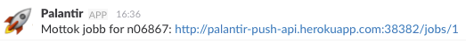

theme: Sketchnote, 1
# [fit] Push-Notifications
# [fit] av jobbstatus

---
# Pushnotifications på status

### Vi ønsker muligheten til å pushe meldinger til bruker mobiltelefon når jobber er ferdige (evt feilet)

- Trygve, Jarle, Stig, Torstein

---

# Idé

- Patchet jobb-sagaen i _bridge_ til å sende ut events når jobber er ferdig
- Egen handler som håndterer den meldingen og gjør *HTTP POST* til _palantir-push-api_
- _palantir-push-api_ har ansvaret for å pushe meldinger
- Notifications plugges inn i _palantir-push-api_

---

## Palantir-Push-API

Holder oversikt over subscriptions og brukervalg
Støtter ulike notificationkanaler

- Slack
- Web-Push/Service Workers
- Amason SNS

---

# Slack
## Incoming Webhook

---

---

- _palantir-push-api_ mottar oppdatering
- *HTTP POST* til _slack incoming webhook_
- Poster nå til _#hackday-palantir-push_
- Kan sende melding til _@slack-bruker_, gitt N-nummer-slack-bruker-kobling

---
# Web-Push
## Service Workers

---

- Støtter seg på _Google Cloud Notifications_
- Webside for registrering av N-nummer
- Webside oppretter GCN-subscription
- Registrerer N-nummer/GCN-subscription mot _palantir-push-api_
- _palantir-push-api_ sender notifications til GCN

---

- Git merverdi både på desktop og mobil
- Nettleser viser notifications på OSX _når nettleser er lukket_
- Gir _native notifications_ på Android-telefoner, uten at man har nettleser oppe
- Litt begrenset browserstøtte..

---

^ [Sequence Diagram](https://www.websequencediagrams.com/?lz=dGl0bGUgQ2xpZW50IE5vdGlmaWNhdGlvbnMKCnBhcnRpY2lwYW50ABoIQnJvd3NlciBhcyBCABMNR29vZwBEBW91ZCBhcyBHQwAyDVBhbGFudGkANAVQAEwNQnJpZGdlAF8NTlJLCgpCLT4rR0M6IE9wcHJldHQgc3Vic2NyaXB0aW9uCkdDLT5COiBbU2Vzc2lvbiBEZXRhaWxzXQpCLT4AYwg6IFJlZ2lzdHJlciB1c2VyL3MAJwYKTlJLLT4rAHIGOiBTdGFydCBKb2IKbm90ZSByaWdodCBvZgCBEQc6IEpvYmIga2rDuHJlcgoAgScGAFgMABoFZnVsbGbDuHJ0CmRlYWN0aXZhdGUAgVEIAIFyCC0-R0M6AIJcBnkAgQsFAIE9CAAHDAo&s=modern-blue)

---
# Amazon SNS
## Simple Notification Service

---

Håndterer bekreftelse og unsubscribe
Støtter flere ulike meldingsformater

- _SMS_
- Epost
- Native application
- Web push (via GCN)
- mfl.
